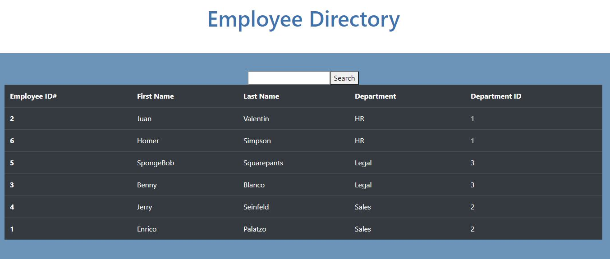

# Employee Directory

- [Deployed App](https://murmuring-lowlands-10192.herokuapp.com/)

## Description:
    This app was created using React to display non-sensitive employee information can that be sorted by all categories as well as search for employee by first name.

## Table of Contents

- [Description](#description)
- [Installation](#installation)
- [Usage](#usage)
- [Contributing](#contributing)
- [Test](#test)
- [Credits](#credits)
- [License](#license)
- [Questions](#questions)

## Installation:
    npm install
 
## Test:
    npm test

## Usage:
    Please clone the repo before use.

## Contributing:
    undefined

## License:
For more information about the MIT License, click on the link below.

- [License](https://opensource.org/licenses/MIT)

## Questions:
For additional information about the ReadMe Generator you can go to my GitHub page at the following link:

- [GitHub Profile](https://github.com/adgrossm)

For additional questions please email me at: adgrossm@gmail.com

 